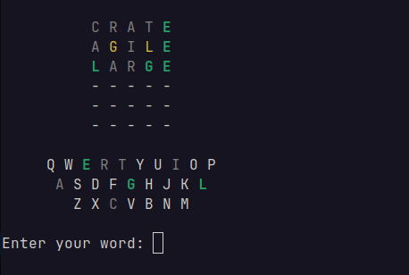

# WordGame CLI
A simple terminal-based word guessing game

**Usage:** wordgame.py [-h] [-n NUM_LETTERS] [-w WORD] [-a] [wordlist.txt]

## Options
- `-n, --num-letters` Sets the size of the words used for the game. The word list file must contain words of this length. The default is word length is 5. Cannot be used with `-w`.

- `-w, --word` Sets the secret word for the game. Used for testing. The word list must contain words of the same length. Cannot be used with `-n`.

- `-a, --alphabetic` Disables QWERTY keyboard letter layout.

- `wordlist.txt` Optional path to a word list file. Files containing words of mixed lengths are supported.
